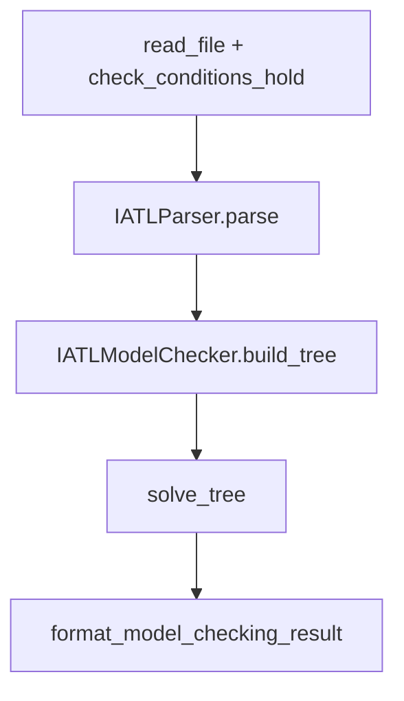

# IATL - Implementation Reference

This document describes how IATL (Intuitionistic Alternating-time Temporal Logic) is
defined and model-checked in `model_checker/algorithms/explicit/IATL/`. It is the
normative reference for behaviour in this codebase.

## Overview

IATL extends ATL with:

1. **Intuitionistic propositional connectives** (`->`, `not`) evaluated with upward
   closure along a knowledge preorder `P`.
2. **Dual coalition modalities** over the same temporal operators:
   - Existential: `<A>` (coalition `A` can enforce a strategy)
   - Universal: `[A]` (all strategies of coalition `A` satisfy the property)

Temporal evolution uses the **BCGS** transition matrix (CGS-style joint actions).
`P` is a separate boolean preorder matrix on the same state set.

| Component | Role |
|-----------|------|
| `P` (`<=_P`) | Knowledge preorder; intuitionistic truth is monotone along `P` |
| BCGS transitions | Multi-agent move profiles; coalition pre-images group joint actions |
| `<A>` | Existential coalition quantifier (`Pre_d`) |
| `[A]` | Universal coalition quantifier (`Pre_f`) |

## BCGS models

### Structure

A model is `M = <S, P, G, V, k>` where:

- `S` is a finite state set.
- `P` is a preorder on `S` (reflexive, transitive, antisymmetric in validated models).
- `G` is the BCGS transition function encoded as an `N x N` matrix of joint action
  profiles (same string format as CGS cells, e.g. `II,AA`).
- `V : S -> 2^AP` is a propositional labelling.
- `k` is the number of agents (`Number_of_agents` in the file).

Validated models satisfy **valuation monotonicity** along `P`:

```text
if s <=_P s' then V(s) subseteq V(s')
```

### Well-behaved constraints (C1, C2)

For each non-empty coalition and each pair of states related by `P`, the
implementation checks **contravariant simulation** of coalition moves (Definition 2
style, per coalition):

**C1:** forward simulation of coalition decisions along `P`.

**C2:** backward simulation (dual of C1 with reversed preorder on outcomes).

Checks are in `util/validation.py` (`_check_well_behaved_c1`, `_check_well_behaved_c2`).

Additional BCGS rules enforced at load time:

- Square transition and preorder matrices.
- Every state has at least one outgoing transition.
- Idle self-loop on each diagonal (`II,...,II` pattern).
- Action profiles are well-formed for `k` agents.

### File format

Models are text files read by `util/graph.read_file` (not the standard CGS parser).

Sections:

```text
Transition
...
Preorder
...
Name_State
...
Initial_State
...
Atomic_propositions
...
Labelling
...
Number_of_agents
...
```

`Preorder` is a `0`/`1` matrix (not the ICTL `P`/`R` cell labels). `Transition`
uses CGS joint-action strings.

`read_file` calls `check_conditions_hold` before returning the model dict.

## Formula language

Parser: `parsers/formulas/IATL/parser.py` (PLY, extends `BaseLogicParser`).

### Propositional

```text
phi ::= p | phi && phi | phi || phi | phi -> phi | ! phi
```

### Coalition temporal operators

```text
phi ::= <A> X phi | <A> F phi | <A> G phi | <A>(phi U psi) | <A>(phi R psi)
      | [A] X phi | [A] F phi | [A] G phi | [A](phi U psi) | [A](phi R psi)
```

- `<A>`: existential coalition (`COALITION` token), e.g. `<1>`, `<1,2>`.
- `[A]`: universal coalition (`COALITION_UNIVERSAL`), e.g. `[1]`, `[1,2]`.
- Temporal sugar: `X`/`next`, `F`/`eventually`, `G`/`globally`, `U`/`until`,
  `R`/`release`.
- Parentheses around `U` / `R` operands are supported.

Coalition strings are validated against `Number_of_agents` at parse time.

## Coalition pre-images

`preimage.py` implements `Pre_d` and `Pre_f` (documented as Bozzelli et al.,
KR 2025, Proposition 2):

| Operator | Meaning |
|----------|---------|
| `Pre_d(A, X)` | States where coalition `A` has a joint move such that **every** opponent response stays in `X` |
| `Pre_f(A, X)` | States where **every** coalition move has **some** opponent response in `X` |

Transitions are grouped by coalition move via `group_moves_by_coalition`. Results
are cached per coalition in `IATLModelChecker.transition_cache_for`.

`IATLModelChecker.pre_exists` / `pre_forall` wrap the pre-image functions with
cached transitions.

## Semantic denotations

Model checking computes `[[phi]] subseteq S` bottom-up on the formula tree.

### Preorder upset and upward closure

For each state `s`, the checker builds the transitive **P-upset** using shared
`get_preorder` from `ICTL/util/graph.py` (boolean preorder matrix entries).

```text
s^up = { t in S | s <=_P t }
X^up = { s in S | s^up subseteq X }
```

`IATLModelChecker.states_with_upset_in(target)` implements `X^up`.

### Propositional connectives

| Formula | Denotation |
|---------|------------|
| atom `p` | `{ s | p in V(s) }` |
| `phi && psi` | intersection |
| `phi \|\| psi` | union |
| `phi -> psi` | `([[phi]]^c union [[psi]])^up` |
| `! phi` | `[[phi]]^c^up` |

### Next

| Formula | Denotation |
|---------|------------|
| `<A> X phi` | `Pre_d(A, [[phi]])` |
| `[A] X phi` | `(Pre_f(A, [[phi]]))^up` |

### Eventually and globally

| Formula | Denotation | Implementation |
|---------|------------|----------------|
| `<A> F phi` | least `mu X. [[phi]] union Pre_d(A, X)` | `least_fixpoint` |
| `[A] F phi` | least `mu X. [[phi]] union Pre_f(A, X)` | `least_fixpoint` |
| `<A> G phi` | greatest `nu X. [[phi]] intersect Pre_d(A, X)` | `greatest_fixpoint` |
| `[A] G phi` | greatest `nu X. [[phi]] intersect Pre_f(A, X)` | `greatest_fixpoint` |

### Until (least fixpoint)

```text
<A>(phi1 U phi2):  mu X. [[phi2]] union ([[phi1]] intersect Pre_d(A, X))
[A](phi1 U phi2):  mu X. [[phi2]] union ([[phi1]] intersect Pre_f(A, X))
```

### Release (greatest fixpoint)

```text
<A>(phi1 R phi2):  nu X. [[phi2]] intersect ([[phi1]] union Pre_d(A, X))
[A](phi1 R phi2):  nu X. [[phi2]] intersect ([[phi1]] union Pre_f(A, X))
```

Implemented via `shared/fixpoint_iter.greatest_fixpoint`.

## Model-checking pipeline



### Entry point (`IATL.py`)

`model_checking` is created through `create_model_checking_entry("IATL", _core_iatl_checking)`.

`_core_iatl_checking`:

1. Wraps loaded BCGS data in `IATLModelChecker`.
2. Parses the formula with agent count from the model.
3. Builds and solves the formula tree.
4. Returns formatted result or syntax/semantic errors.

### Solver dispatch (`solver.py`)

`solve_tree` evaluates children first, then dispatches using `FormulaParserFactory`
token verification:

| Parser label | Handler |
|--------------|---------|
| `NOT` | `handle_not` |
| `<A>G` | `handle_coalition_globally_exists` |
| `[A]G` | `handle_coalition_globally_forall` |
| `<A>X` | `handle_coalition_next_exists` |
| `[A]X` | `handle_coalition_next_forall` |
| `<A>F` | `handle_coalition_eventually_exists` |
| `[A]F` | `handle_coalition_eventually_forall` |
| `<A>U` | `handle_coalition_until_exists` |
| `[A]U` | `handle_coalition_until_forall` |
| `<A>R` | `handle_coalition_release_exists` |
| `[A]R` | `handle_coalition_release_forall` |

Coalition labels are parsed from node values with `coalition_from_node` in
`operators.py`.

### Shared code

| Shared module | Use in IATL |
|-------------|---------------|
| `ICTL/util/graph.get_preorder` | Transitive P-upset |
| `shared/fixpoint_iter` | `F`, `G`, `U`, `R` fixpoints |
| `shared/result_utils` | Result formatting |
| `engine/execution.create_model_checking_entry` | VMI entry point |
| `parsers/formulas/parser_utils` | Coalition validation |

IATL keeps its own `preimage.py` because BCGS models use string matrix cells and
a dict-based loader, while explicit ATL uses the `CGS` class and bitmask graph.

### Complexity

Coalition model checking is polynomial in `|S|`, `|phi|`, and action profile size;
pre-image caching avoids rebuilding coalition move groups on every fixpoint step.

## Code map

| Path | Role |
|------|------|
| `IATL/IATL.py` | Entry point |
| `IATL/checker.py` | `IATLModelChecker`, pre-images, `^up` |
| `IATL/solver.py` | `solve_tree` dispatch |
| `IATL/operators.py` | Operator handlers |
| `IATL/preimage.py` | `Pre_d`, `Pre_f`, transition cache |
| `IATL/util/graph.py` | `read_file`, `get_actions` |
| `IATL/util/validation.py` | `check_conditions_hold` |
| `parsers/formulas/IATL/parser.py` | Formula parser |

Parser metadata: `model_type: "CGS"` (BCGS files use the extended `Preorder` section).

## Tests

| Path | Coverage |
|------|----------|
| `tests/integration/algorithms/iatl/test_smoke.py` | Load, pre-images, operator smoke, `!p` with custom states |
| `tests/integration/algorithms/iatl/test_correctness.py` | Pinned fixture semantics, `^up`, validation |
| `tests/fixtures/CGS/IATL/iatl_2agents_2states_minimal.txt` | Minimal 2-agent BCGS |

## Background literature

IATL follows the intuitionistic ATL line of work, including coalition pre-images as
in Bozzelli et al. (KR 2025). This file documents the code path in
`vitamin-model-checker`, not a particular published axiomatization in full.
