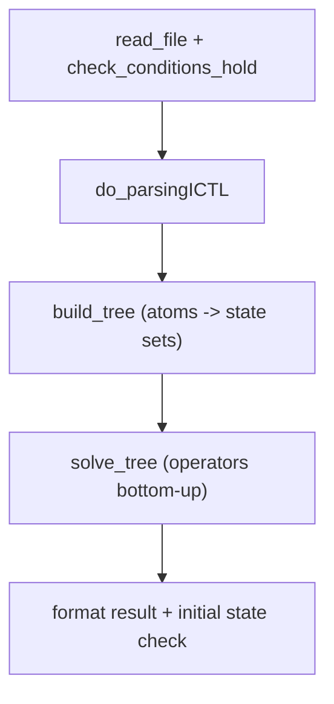

# ICTL - Theory, Model Checking, and Implementation Notes

ICTL (Intuitionistic Computation Tree Logic) extends CTL with intuitionistic
propositional connectives. Truth can grow along a preorder that models
information acquisition, while temporal evolution uses a separate transition
relation.

This document is the reference for the algorithm in
`model_checker/algorithms/explicit/ICTL/`. It summarizes the published theory,
maps it to the code, and lists changes required for full alignment with the
reference papers.

## References

| Reference | What it defines |
|-----------|-----------------|
| [Reasoning about Intuitionistic Computation Tree Logic (2023)](https://arxiv.org/pdf/2310.02355) | Syntax, birelational semantics, C1/C2, basic properties |
| [An Intuitionistic Version of Computation Tree Logic (EUMAS 2025)](https://vadimmalvone.github.io/papers/EUMAS25b.pdf) | Refined well-behaved models, fixpoint characterizations, Figure 7 model-checking algorithm |
| VMI bundle `examples/ictl-bundle` | Original integrated prototype (not the normative spec) |

Authors: Davide Catta, Vadim Malvone, Aniello Murano (and co-authors on the 2025 paper).

## Motivation

Classical CTL assumes complete information at each state. ICTL separates:

1. **Knowledge preorder `P` (`<=_P`)** - information may increase; truth is monotone
   along `P`.
2. **Transition relation `R`** - serial system evolution (paths are infinite `R`-chains).

A verifier checks temporal properties while knowledge of the model may still be
incomplete or evolving. Example use cases in the papers include database write
persistence and monitoring under progressive observation.

## Birelational models

### Frame

A **birelational frame** is `F = <S, P, R>` where:

- `S` is a finite set of states (worlds).
- `P` is a **preorder** on `S` (reflexive, transitive; antisymmetric in the
  implementation).
- `R` is a **serial** binary relation: every state has at least one `R`-successor.

A **path** is an infinite sequence `s0, s1, s2, ...` with `si R s(i+1)` for all
`i >= 0`.

### Well-behaved frames (C1 and C2)

Published ICTL requires **confluence** between `P` and `R`:

**C1** (forward simulation along `P`):

```text
if s <=_P s' and s -R-> t, then exists t' with s' -R-> t' and t <=_P t'
```

**C2** (backward simulation along `P`):

```text
if s <=_P s' and s' -R-> t', then exists t with s -R-> t and t <=_P t'
```

C1 ensures existential path formulas are monotone along `P`. C2 ensures universal
path formulas are monotone along `P`.

### Model

A **birelational model** is `M = <S, P, R, V>` where `V : S -> 2^AP` satisfies
**valuation monotonicity**:

```text
if s <=_P s' then V(s) subseteq V(s')
```

### Matrix encoding in VITAMIN

ICTL models are stored as an `N x N` matrix (not a standard CGS file). Each cell
`(i, j)` is one of:

| Cell | Meaning |
|------|---------|
| `0` | no relation |
| `R` | transition only |
| `P` | preorder only |
| `P,R` | both |
| `*` on diagonal | reflexive loop (typically `P` or `P,R`) |

Sections in the model file:

```text
Transition
...
Name_State
...
Initial_State
...
Atomic_propositions
...
Labelling
...
```

Validation lives in `model_checker/algorithms/explicit/ICTL/util/validation.py`
(`check_conditions_hold`).

### Extra constraint C3 (implementation only)

The codebase also checks a third birelational constraint (C3):

```text
if s -P-> y and y -R-> z, then exists u with s -R-> u and u -P-> z
```

This appears in the 2023 paper as a **future** structural condition, not in
Definition 2. The validator treats C1/C2 as one combined check plus C3
separately. Models valid under the papers may fail C3 here, and vice versa.
Decide explicitly whether C3 remains a project requirement.

## Formula syntax

Grammar (papers + parser in `ictl_ply_parser.py`):

```text
phi ::= p | bot | phi /\ phi | phi \/ phi | phi -> phi
      | E X phi | E(phi U psi) | E(phi R psi)
      | A X phi | A(phi U psi) | A(phi R psi)
```

Negation: `not phi` is `phi -> bot`.

The parser also accepts sugar (not in the papers' core grammar):

| Sugar | Desugaring |
|-------|------------|
| `EF phi` | `E(true U phi)` via `E` + `F` tokens |
| `AF phi` | `A(true U phi)` |
| `EG phi` | `E(phi R false)` / `G` globally |
| `AG phi` | `A(phi R false)` |

**Release syntax:** use spaced form `E phi R psi`, not `E[phi R psi]` (brackets
break parsing because `R` is the release token).

**Coalitions:** none. ICTL uses path quantifiers `E` and `A` only.

## Semantics (informal)

Satisfaction `M, s |= phi` is defined inductively. Compared to CTL:

| Connective | Intuitionistic? | Idea |
|------------|-----------------|------|
| `p`, `/\`, `\/` | partly | Atoms and booleans as usual at `s` |
| `->`, `not` | yes | Checked over all `P`-refinements of `s` |
| `E psi`, `A psi` | path-based | Quantify over infinite `R`-paths from `s` |
| `X`, `U`, `R` | on paths | Same path reading as CTL on relation `R` |

**Monotonicity (Proposition 1, 2023):** if `M, s |= phi` and `s <=_P s'`, then
`M, s' |= phi`.

**No classical dualities:** e.g. `A X phi <-> not E X not phi` is **not** valid
in ICTL (see EUMAS 2025, Proposition 3).

### Upward closure

For `X subseteq S`, define:

```text
s^up = { t in S | s <=_P t }          (P-upset of s)
X^up = { s in S | s^up subseteq X }   (upward-closed states below X)
```

Published denotations (EUMAS 2025, Proposition 5):

```text
[[phi -> psi]] = ([[phi]]^c union [[psi]])^up
[[E X phi]]    = Pre_exists([[phi]])
[[A X phi]]    = (Pre_forall([[phi]]))^up
```

where `Pre_exists` / `Pre_forall` use **only** relation `R` (transition edges),
not `P`.

### Fixpoint characterizations (EUMAS 2025, Theorem 3)

For sets of states `[[phi1]]`, `[[phi2]]`:

| Operator | Fixpoint | Update function g(X) |
|----------|----------|----------------------|
| `E(phi1 U phi2)` | **least** | `[[phi2]] union ([[phi1]] intersect Pre_exists(X))` |
| `E(phi1 R phi2)` | **greatest** | `[[phi2]] intersect ([[phi1]] union Pre_exists(X))` |
| `A(phi1 U phi2)` | **least** | `[[phi2]] union ([[phi1]] intersect Pre_forall(X))` |
| `A(phi1 R phi2)` | **greatest** | `[[phi2]] intersect ([[phi1]] union Pre_forall(X))` |

`EF`, `EG`, `AF`, `AG` follow from `U` / `R` with constant `true` / `false` as
in CTL, evaluated on `R` only.

## Model-checking algorithm (Figure 7)

The reference algorithm is **bottom-up** on the formula parse tree. For each
subformula `phi`, compute `[[phi]]` as a subset of `S`.



### Per-operator cases (normative)

From EUMAS 2025, Figure 7:

| Subformula | Computation |
|------------|-------------|
| `p` | `{ s | p in V(s) }` |
| `phi1 \/ phi2` | union |
| `phi1 /\ phi2` | intersection |
| `phi1 -> phi2` | `([[phi1]]^c union [[phi2]])^up` |
| `E X phi1` | `Pre_exists([[phi1]])` |
| `A X phi1` | `Pre_forall([[phi1]])` then **no** `^up` in Figure 7 case line; Proposition 5 adds `^up` |
| `E(phi1 U phi2)` | least fixpoint loop (see below) |
| `A(phi1 U phi2)` | same with `Pre_forall` |
| `E(phi1 R phi2)` | greatest fixpoint loop (see below) |
| `A(phi1 R phi2)` | same with `Pre_forall` |

**Until (least fixpoint):**

```text
Q1 := emptyset;  Q2 := [[phi1]];  Q3 := [[phi2]]
while Q3 not subseteq Q1:
    Q1 := Q1 union Q3
    Q3 := Pre_op(Q1) intersect Q2
[[E(phi1 U phi2)]] := Q1
```

(`Pre_op` is `Pre_exists` for `E`, `Pre_forall` for `A`.)

**Release (greatest fixpoint):**

```text
Q1 := S;  Q2 := [[phi1]];  Q3 := [[phi2]]
while Q1 not subseteq Q3:
    Q1 := Q1 intersect Q3
    Q3 := Pre_op(Q1) union Q2
[[E(phi1 R phi2)]] := Q1
```

Complexity: **O(|M|^2 * |phi|)** (PTIME-complete), same order as CTL model checking.

## Code map

| Module | Role |
|--------|------|
| `ICTL/ICTL.py` | Entry points: `model_checking`, `run_model_checking`, file/generated wrappers |
| `ICTL/checker.py` | `ICTLModelChecker`: edges, preorder edges, upward closure, `build_tree` |
| `ICTL/solver.py` | `solve_tree`: dispatch to operator handlers |
| `ICTL/operators.py` | Per-operator state-set updates |
| `ICTL/preimage.py` | `pre_image_exist`, `pre_image_all` on `R` |
| `ICTL/util/graph.py` | `read_file`, `labeled_pairs`, `get_preorder` |
| `ICTL/util/validation.py` | Birelational well-formedness |
| `ICTL/util/generators.py` | `generate_experiment_model` for tests |
| `parsers/formulas/ICTL/` | PLY parser |

ICTL is **not** registered under `vitamin.benchmarks` (no synthetic benchmark
matrix for birelational models). VMI entry point `model_checking(formula, filename)`
remains in `ICTL.py`.

## Correctness gaps (current implementation vs papers)

The following items must be addressed for theory-aligned behavior. Status reflects
the codebase as of the ICTL refactor in `vitamin-model-checker`.

### 1. Upward closure uses direct `P`-edges only

**Paper:** `s^up` is the full preorder upset (transitive closure of `P`).

**Code:** `get_preorder` in `util/graph.py` records only **direct** matrix cells
labelled `P` or `P,R`, not transitive `<=_P`.

**Impact:** `not`, `->`, and any operator using `^up` are approximate.

**Fix:** After building the boolean preorder matrix, compute its transitive
closure (e.g. boolean matrix power / Floyd-Warshall) before defining `s^up`.

### 2. `AX` omits upward closure

**Paper:** `[[A X phi]] = (Pre_forall([[phi]]))^up` (2023 Proposition 2.3; 2025
Proposition 5).

**Code:** `handle_ax` computes classical `S \\ Pre_exists(S \\ [[phi]])`, which
equals `Pre_forall([[phi]])` on total deterministic transition systems but
**does not** apply `^up`.

**Fix:** After `Pre_forall`, apply the same `^up` operator used for implication.

### 3. Release operators `E(phi R psi)` and `A(phi R psi)`

**Paper (Figure 7):** greatest fixpoint with `Q1 intersect Q3` and
`Q3 := Pre_op(Q1) union [[phi1]]`.

**Code:** `handle_er` / `handle_ar` use an EG-style loop:
`p = t; t = Pre_op(p) intersect [[phi1]]`, which is **not** Figure 7.

**VMI prototype:** release branch is **broken** (`p` never updated; result is
often all states).

**Fix:** Implement Figure 7 release loops in `operators.py`. Add integration
tests with hand-checked small models.

### 4. Validation C3 vs published C1/C2 only

**Paper:** well-behaved = C1 + C2 + monotone valuation.

**Code:** also enforces C3.

**Fix:** Document the choice in `validation.py` or split "paper-conformant" vs
"strict" validation modes.

### 5. Test coverage

**Current:** three smoke tests in `tests/integration/algorithms/ictl/`.

**Needed:**

- Fixture model (e.g. `examples/ictl_example.txt` from VMI bundle) with pinned
  results for `EX e`, `EF e`, `AG e`, `!(e -> h)`.
- Countermodels from EUMAS 2025 Figures 4-5 for non-dualities.
- Release and until cases after Figure 7 is implemented.
- Regression vs VMI bundle **only** where VMI matches the papers (not for release).

## Checklist for a theory-correct implementation

Use this when changing ICTL code or reviewing PRs:

- [ ] Preorder `P`: reflexive, transitive, antisymmetric checks match intended spec
- [ ] C1 and C2 (and optionally C3) documented and tested
- [ ] Valuation monotonicity along `P`
- [ ] `^up` uses **transitive** `<=_P`, not one-hop neighbours
- [ ] `Pre_exists` / `Pre_forall` use **R** edges only (`labeled_pairs` predicate)
- [ ] `EX`, `EF`, `EG`, `EU` match least-fixpoint Figure 7 / Theorem 3
- [ ] `AX` uses `(Pre_forall)^up`
- [ ] `AF`, `AG` derived consistently (no classical duality shortcuts unless proven)
- [ ] `ER`, `AR` match greatest-fixpoint Figure 7
- [ ] Parser sugar `F`/`G` desugars consistently with path semantics
- [ ] Integration tests cover paper examples and edge cases
- [ ] Docs and `logic_knowledge_base.md` stay in sync

## Related documentation

- [Logic Knowledge Base - ICTL syntax summary](../logic_knowledge_base.md#ictl---intuitionistic-ctl)
- [File formats](../file_formats.md) (matrix model; metadata lists `CGS` but ICTL
  uses its own `read_file`, not the CGS parser)
- [Architecture](../architecture.md) - ICTL under `algorithms/explicit/ICTL/`

## Further reading

- Intuitionistic modal models: Plotkin and Stirling (1986), cited in the 2023 paper.
- Intuitionistic LTL on expanding frames: Balbiani et al., *Intuitionistic Linear
  Temporal Logics* ([DOI 10.1145/3365833](https://doi.org/10.1145/3365833)) -
  same birelational idea, linear time.
