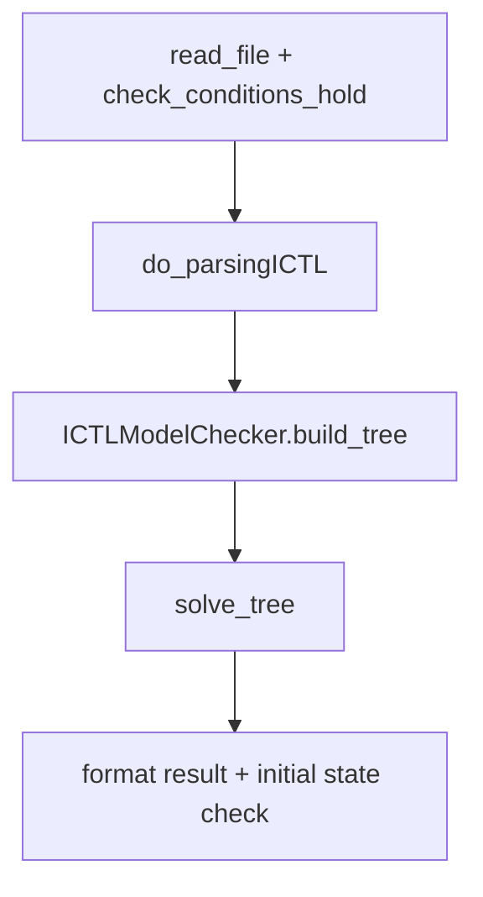

# ICTL - Implementation Reference

This document describes how ICTL (Intuitionistic Computation Tree Logic) is defined
and model-checked in `model_checker/algorithms/explicit/ICTL/`. It is the normative
reference for behaviour in this codebase.

## Overview

ICTL extends branching-time temporal reasoning with intuitionistic propositional
connectives. The implementation uses **birelational models**: two relations on the
same finite state set `S`.

| Relation | Role |
|----------|------|
| `P` (`<=_P`) | Knowledge preorder: information may grow; intuitionistic truth is monotone along `P` |
| `R` | Transition relation: serial evolution; path quantifiers range over infinite `R`-paths |

Classical CTL treats each state as fully informed. Here, `P` models incomplete or
evolving knowledge while `R` models system dynamics.

## Birelational models

### Frame

A frame is `F = <S, P, R>` where:

- `S` is a finite set of states.
- `P` is a preorder on `S` (reflexive, transitive, antisymmetric in validated models).
- `R` is serial: every state has at least one `R`-successor.

An **R-path** from `s` is an infinite sequence `s0, s1, s2, ...` with `s0 = s` and
`s_i R s_(i+1)` for all `i >= 0`.

### Model

A model is `M = <S, P, R, V>` with valuation `V : S -> 2^AP`. Validated models
satisfy **valuation monotonicity**:

```text
if s <=_P s' then V(s) subseteq V(s')
```

### Structural constraints (C1, C2, C3)

Validated models must satisfy confluence between `P` and `R`.

**C1** (forward simulation along `P`):

```text
if s <=_P s' and s -R-> t, then exists t' with s' -R-> t' and t <=_P t'
```

**C2** (backward simulation along `P`):

```text
if s <=_P s' and s' -R-> t', then exists t with s -R-> t and t <=_P t'
```

**C3** (additional constraint enforced by this implementation):

```text
if s -P-> y and y -R-> z, then exists u with s -R-> u and u -P-> z
```

All three are checked in `util/validation.py` via `check_conditions_hold`.

### Matrix file format

ICTL models are **not** loaded through the standard CGS parser. They use a dedicated
`N x N` matrix text file read by `util/graph.read_file`.

Each cell `(i, j)` is one of:

| Cell | Meaning |
|------|---------|
| `0` | no relation |
| `R` | transition only |
| `P` | preorder only |
| `P,R` | both |
| `*` | reflexive loop on the diagonal (treated as `(s_i, s_i)`) |

File sections (in any order of blocks, each introduced by a header line):

```text
Transition
...
Name_State
...
Initial_State
...
Atomic_propositions
...
Labelling
...
```

`Labelling` rows are boolean vectors over `Atomic_propositions` (0/1).

At load time, `read_file` parses the file and calls `check_conditions_hold`. Invalid
models raise `AssertionError`.

## Formula language

The PLY parser lives in `parsers/formulas/ICTL/ictl_ply_parser.py`.

### Core grammar

```text
phi ::= p | phi /\ phi | phi \/ phi | phi -> phi | not phi
      | E X phi | E(phi U psi) | E(phi R psi)
      | A X phi | A(phi U psi) | A(phi R psi)
```

- Atoms: lowercase alphanumeric (`e`, `p1`, ...).
- Negation: `not phi` or `! phi` (no `bot` literal; handled as intuitionistic negation).
- Implication: `->`, `>`, or `implies`.
- Conjunction / disjunction: `&&`, `&`, `and` / `||`, `|`, `or`.
- Path quantifiers: `E` / `exist`, `A` / `forall`.
- Temporal: `X` / `next`, `U` / `until`, `R` / `release`.

**Release syntax:** use spaced form `E p R q`. Bracketed forms like `E[p R q]` fail
because `R` is the release token.

There are no coalition quantifiers.

### Sugar (`F` / `G`)

The parser accepts `F` / `eventually` and `G` / `globally` as unary temporal
operators after `E` or `A`:

| Surface syntax | Parser output | Handler |
|----------------|---------------|---------|
| `EF phi` | `EXIST` + `EVENTUALLY` | `handle_ef` |
| `EG phi` | `EXIST` + `GLOBALLY` | `handle_eg` |
| `AF phi` | `FORALL` + `EVENTUALLY` | `handle_af` |
| `AG phi` | `FORALL` + `GLOBALLY` | `handle_ag` |

Sugar is **not** rewritten at parse time to `U` / `R` forms. The solver dispatches
directly to the dedicated handler for each sugar operator.

## Semantic denotations

Model checking computes `[[phi]] subseteq S` for each subformula. Write `Pre_exists`
and `Pre_forall` for pre-images along **R-edges only** (`preimage.py`).

### Preorder upset and upward closure

For each state `s`, the checker precomputes the **P-upset** (transitive closure of
direct `P` edges from the matrix):

```text
s^up = { t in S | s <=_P t }
```

`get_preorder` in `util/graph.py` builds this map. `ICTLModelChecker.upward_closure`
stores it; `states_with_upset_in(target)` implements the upward-closure operator:

```text
X^up = { s in S | s^up subseteq X }
```

### Propositional and intuitionistic connectives

| Formula | Denotation `[[.]]` |
|---------|-------------------|
| atom `p` | `{ s | p in V(s) }` |
| `phi /\ psi` | `[[phi]] intersect [[psi]]` |
| `phi \/ psi` | `[[phi]] union [[psi]]` |
| `phi -> psi` | `([[phi]]^c union [[psi]])^up` |
| `not phi` | `[[phi]]^c^up` (same as `phi -> bot` with empty codomain) |

### Next and pre-images

| Formula | Denotation |
|---------|------------|
| `E X phi` | `Pre_exists([[phi]])` |
| `A X phi` | `(Pre_forall([[phi]]))^up` |

`Pre_forall([[phi]])` is computed as `S \\ Pre_exists(S \\ [[phi]])`.

### Until (least fixpoint)

`E(phi1 U phi2)` and `A(phi1 U phi2)` use the least fixpoint:

```text
g(X) = [[phi2]] union ([[phi1]] intersect Pre_op(X))
```

`Pre_op` is `Pre_exists` for `E`, `Pre_forall` for `A`. Implemented incrementally in
`handle_eu` / `handle_au`:

```text
Q1 := emptyset;  Q3 := [[phi2]]
while Q3 not subseteq Q1:
    Q1 := Q1 union Q3
    Q3 := Pre_op(Q1) intersect [[phi1]]
```

### Release (greatest fixpoint)

`E(phi1 R phi2)` and `A(phi1 R phi2)` use the greatest fixpoint:

```text
g(X) = [[phi2]] intersect ([[phi1]] union Pre_op(X))
```

Implemented in `handle_er` / `handle_ar` via `shared/fixpoint_iter.greatest_fixpoint`.

### Eventually and globally (sugar handlers)

These use dedicated fixpoint loops in `operators.py` rather than calling `handle_eu`
/ `handle_er` with constant formulas.

**`EF phi`** (`handle_ef`) -- least fixpoint reachability along `R`:

```text
Q := emptyset;  T := [[phi]]
while T not subseteq Q:
    Q := Q union T
    T := Pre_exists(Q)
```

**`EG phi`** (`handle_eg`) -- greatest fixpoint:

```text
Q := S;  T := [[phi]]
while Q != T:
    Q := T
    T := Pre_exists(Q) intersect [[phi]]
```

**`AF phi`** (`handle_af`) -- complement-based greatest fixpoint on `~[[phi]]`,
then subtract from `S`:

```text
C := S \\ [[phi]]
Q := S;  T := C
while Q != T:
    Q := T
    T := Pre_forall(Q) intersect C
result := S \\ Q
```

**`AG phi`** (`handle_ag`) -- complement-based least fixpoint on `~[[phi]]`,
then subtract from `S`:

```text
C := S \\ [[phi]]
Q := emptyset;  T := C
while T not subseteq Q:
    Q := Q union T
    T := Pre_forall(Q)
result := S \\ Q
```

## Model-checking pipeline

Evaluation is **bottom-up** on the formula parse tree. Each node holds a string
encoding of a state set; children are evaluated before parents.



### Entry points (`ICTL.py`)

| Function | Purpose |
|----------|---------|
| `model_checking(formula, filename)` | VMI-compatible wrapper |
| `process_model_checking_from_file` | Load matrix file and check |
| `process_model_checking_generated` | Synthetic model via `generate_experiment_model` |
| `run_model_checking` | Core: parse, build tree, solve |

### Checker setup (`checker.py`)

On construction, `ICTLModelChecker`:

1. Extracts **R-edges** from matrix cells not in `0` or `P`.
2. Extracts **P-edges** from cells `P` or `P,R`.
3. Builds `upward_closure` via transitive closure of `P`.

`build_tree` resolves atoms to state sets using the labelling matrix.

### Solver dispatch (`solver.py`)

`solve_tree` walks the formula tree post-order. Unary and binary node labels are
matched with `verifyICTL` and routed to handlers in `operators.py`.

### Operator summary

| Operator | Module | Function |
|----------|--------|----------|
| `not`, `->` | `operators.py` | `handle_not`, `handle_implies` |
| `/\`, `\/` | `operators.py` | `handle_and`, `handle_or` |
| `EX`, `AX` | `operators.py` | `handle_ex`, `handle_ax` |
| `EU`, `AU` | `operators.py` | `handle_eu`, `handle_au` |
| `ER`, `AR` | `operators.py` | `handle_er`, `handle_ar` |
| `EF`, `EG`, `AF`, `AG` | `operators.py` | `handle_ef`, `handle_eg`, `handle_af`, `handle_ag` |
| `Pre_exists`, `Pre_forall` | `preimage.py` | `pre_image_exist`, `pre_image_all` |

### Complexity

Explicit set-based model checking is `O(|S|^2 * |phi|)` in the size of the model
and formula.

## Code map

| Path | Role |
|------|------|
| `ICTL/ICTL.py` | Entry points and result formatting |
| `ICTL/checker.py` | `ICTLModelChecker`, atom resolution, `^up` helper |
| `ICTL/solver.py` | `solve_tree` dispatch |
| `ICTL/operators.py` | Per-operator state-set updates |
| `ICTL/preimage.py` | R-pre-images |
| `ICTL/util/graph.py` | `read_file`, `labeled_pairs`, `get_preorder` |
| `ICTL/util/validation.py` | `check_conditions_hold` |
| `ICTL/util/generators.py` | `generate_experiment_model` (tests) |
| `parsers/formulas/ICTL/` | PLY parser and `ICTLParser` wrapper |

ICTL is not registered under `vitamin.benchmarks`. Parser metadata lists
`model_type: "CGS"` for VMI compatibility; models still use the matrix format above.

## Tests

| Path | Coverage |
|------|----------|
| `tests/integration/algorithms/ictl/test_smoke.py` | Generator validation, basic runs |
| `tests/integration/algorithms/ictl/test_correctness.py` | Transitive `^up`, `AX`, release, pinned fixture semantics |
| `tests/integration/algorithms/ictl/fixtures/experiment_2x3.txt` | Deterministic 6-state model |

## Background literature

ICTL in this project follows the birelational intuitionistic CTL line of work, e.g.:

- Catta, Malvone, Murano et al., *Reasoning about Intuitionistic Computation Tree Logic* ([arXiv:2310.02355](https://arxiv.org/pdf/2310.02355))
- *An Intuitionistic Version of Computation Tree Logic* ([EUMAS 2025](https://vadimmalvone.github.io/papers/EUMAS25b.pdf))

Those sources motivate the logic; this file documents what the code actually does.
