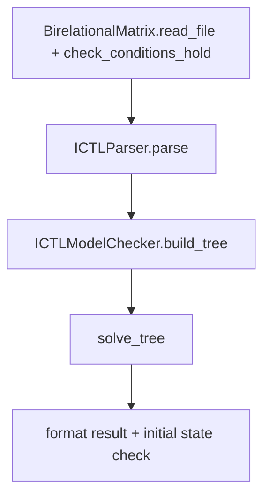

# ICTL - Implementation Reference

This document is the **algorithm correctness reference** for ICTL: denotations,
well-behavedness checks, fixpoint shapes, and the code path that implements them
in `model_checker/algorithms/explicit/ICTL/`. For surface syntax and a short
theory overview, see [logic_knowledge_base.md](../logic_knowledge_base.md). For
how to write model files, see [file_formats.md](../file_formats.md).

## Overview

ICTL extends branching-time temporal reasoning with intuitionistic propositional
connectives. The implementation uses **birelational models**: two relations on the
same finite state set `S`.

| Relation | Role |
|----------|------|
| `P` (`<=_P`) | Knowledge preorder: information may grow; intuitionistic truth is monotone along `P` |
| `R` | Transition relation: serial evolution; path quantifiers range over infinite `R`-paths |

Classical CTL treats each state as fully informed. Here, `P` models incomplete or
evolving knowledge while `R` models system dynamics.

## Birelational models

### Frame

A frame is `F = <S, P, R>` where:

- `S` is a finite set of states.
- `P` is a partial order on `S` in validated models (reflexive, transitive, antisymmetric).
- `R` is serial: every state has at least one `R`-successor.

An **R-path** from `s` is an infinite sequence `s0, s1, s2, ...` with `s0 = s` and
`s_i R s_(i+1)` for all `i >= 0`.

### Model

A model is `M = <S, P, R, V>` with valuation `V : S -> 2^AP`. Validated models
satisfy **valuation monotonicity**:

```text
if s <=_P s' then V(s) subseteq V(s')
```

### Well-behavedness (EUMAS Def. 1)

Validated models must satisfy confluence between `P` and `R`. EUMAS25b Definition 1
uses exactly two conditions; Theorem 1 proves they are necessary and sufficient for
ICTL monotonicity. There is no third confluence axiom in the paper.

**C1** (forward simulation along `P`):

```text
if s <=_P s' and s -R-> t, then exists t' with s' -R-> t' and t <=_P t'
```

**C2** (backward simulation along `P`):

```text
if s <=_P s' and s' -R-> t', then exists t with s -R-> t and t <=_P t'
```

`check_conditions_hold` in `util/validation.py` also enforces:

- square adjacency matrix
- serial `R` (cells `R` or `P,R`)
- reflexive, transitive, antisymmetric `P` (cells `P` or `P,R`)
- monotone labelling along `P`

Negative cases live in `tests/unit/algorithms/ictl/test_validation_negative.py`.

### Matrix file format

ICTL models use the sectioned text format shared with CGS, loaded by
`parsers/game_structures/birelational_matrix/birelational_matrix.py`
(`BirelationalMatrix`, a `CGS` subclass). After ordinary CGS parsing,
`validate_model_structure` calls `check_conditions_hold`.

Each cell `(i, j)` is one of:

| Cell | Meaning |
|------|---------|
| `0` | no relation |
| `R` | transition only |
| `P` | preorder only |
| `P,R` | both (typical diagonal for reflexive knowledge and a self-loop) |

Prefer `P` or `P,R` on the diagonal so reflexivity of `P` holds. Bare `*` is a
CGS idle/self-loop convention and is not a valid ICTL preorder marker.

File sections (each introduced by a header line):

```text
Transition
...
Name_State
...
Initial_State
...
Atomic_propositions
...
Labelling
...
```

`Number_of_agents` is optional; if omitted, `BirelationalMatrix` defaults it to `1`.
`Labelling` rows are boolean vectors over `Atomic_propositions` (0/1).

Invalid structure raises during load (`ValueError` from CGS checks, or
`AssertionError` from ICTL well-behavedness checks).

## Formula language

The PLY parser is `parsers/formulas/ICTL/parser.py` (`ICTLParser`).

### Core grammar

```text
phi ::= p | phi /\ phi | phi \/ phi | phi -> phi | not phi
      | E X phi | E(phi U psi) | E(phi R psi)
      | A X phi | A(phi U psi) | A(phi R psi)
```

- Atoms: identifiers matching `[a-zA-Z][a-zA-Z0-9_]*` (for example `e`, `Goal`).
  Path quantifiers and temporal tokens (`E`/`A`/`X`/`F`/`G`/`U`/`R`, and keywords)
  are lexed separately so forms such as `EX` / `AG` are operators, not atoms.
- Negation: `not phi` or `! phi`.
- Implication: `->`, `>`, or `implies`.
- Conjunction / disjunction: `&&`, `&`, `and` / `||`, `|`, `or`.
- Path quantifiers: `E` / `exist`, `A` / `forall`.
- Temporal: `X` / `next`, `U` / `until`, `R` / `release`.

**Release syntax:** use spaced form `E p R q`. Bracketed forms like `E[p R q]` fail
because `R` is the release token.

There are no coalition quantifiers. Parser metadata declares
`model_type: "BirelationalMatrix"`.

### Sugar (`F` / `G`)

The parser accepts `F` / `eventually` and `G` / `globally` after `E` or `A`:

| Surface syntax | Paper encoding | Handler |
|----------------|----------------|---------|
| `EF phi` | `E(T U phi)` | `handle_ef` |
| `EG phi` | `E(bottom R phi)` | `handle_eg` |
| `AF phi` | `A(T U phi)` | `handle_af` |
| `AG phi` | `A(bottom R phi)` | `handle_ag` |

Sugar is not rewritten to `U` / `R` at parse time. The solver calls the dedicated
handler for each sugar operator.

## Semantic denotations

Model checking computes `[[phi]] subseteq S` for each subformula. Write `Pre_exists`
and `Pre_forall` for pre-images along **R-edges only** (`preimage.py`).

### Preorder upset and upward closure

For each state `s`, the checker precomputes the **P-upset** (transitive closure of
direct `P` edges from the matrix):

```text
s^up = { t in S | s <=_P t }
```

`get_preorder` in `util/graph.py` builds this map. `ICTLModelChecker.upward_closure`
stores it; `states_with_upset_in(target)` implements:

```text
X^up = { s in S | s^up subseteq X }
```

### Propositional and intuitionistic connectives

| Formula | Denotation `[[.]]` |
|---------|-------------------|
| atom `p` | `{ s | p in V(s) }` |
| `phi /\ psi` | `[[phi]] intersect [[psi]]` |
| `phi \/ psi` | `[[phi]] union [[psi]]` |
| `phi -> psi` | `([[phi]]^c union [[psi]])^up` |
| `not phi` | `([[phi]]^c)^up` (intuitionistic negation) |

### Next and pre-images

| Formula | Denotation |
|---------|------------|
| `E X phi` | `Pre_exists([[phi]])` |
| `A X phi` | `Pre_forall([[phi]])` |

`Pre_exists(X)` is implemented by collecting R-predecessors of `X`.
`Pre_forall(X)` keeps states whose entire R-successor set is contained in `X`
(equivalent to `S \\ Pre_exists(S \\ X)` when `R` is serial).

Upward closure (`^up`) applies only to intuitionistic connectives (`->`, `not`),
not to `AX` (EUMAS25b Proposition 5, Figure 7).

### Until (least fixpoint)

`E(phi1 U phi2)` and `A(phi1 U phi2)` use:

```text
g(X) = [[phi2]] union ([[phi1]] intersect Pre_op(X))
```

`Pre_op` is `Pre_exists` for `E`, `Pre_forall` for `A`. Handlers: `handle_eu` /
`handle_au`.

### Release (greatest fixpoint)

`E(phi1 R phi2)` and `A(phi1 R phi2)` use:

```text
g(X) = [[phi2]] intersect ([[phi1]] union Pre_op(X))
```

Handlers: `handle_er` / `handle_ar` / `handle_ag` use
`shared/fixpoint_iter.greatest_fixpoint`; `handle_eg` uses an equivalent manual loop.

### Eventually and globally

`EF` / `EG` / `AF` / `AG` follow the paper encodings above. Classical CTL
complement dualities (for example `AF phi` as `S \\ EG(~phi)`) are **not** used;
they are invalid in ICTL (EUMAS25b Proposition 3).

| Operator | Fixpoint shape |
|----------|----------------|
| `EF phi` | least: grow from `[[phi]]` under `Pre_exists` |
| `EG phi` | greatest: shrink under `Pre_exists` intersect `[[phi]]` |
| `AF phi` | least: grow from `[[phi]]` under `Pre_forall` |
| `AG phi` | greatest: shrink under `Pre_forall` intersect `[[phi]]` |

## Model-checking pipeline

Evaluation is bottom-up on the formula parse tree.


```mermaid
flowchart TD
    load["BirelationalMatrix.read_file + check_conditions_hold"]
    parse["ICTLParser.parse"]
    tree["ICTLModelChecker.build_tree"]
    solve["solve_tree"]
    result["format result + initial state check"]

    load --> parse --> tree --> solve --> result
```

### Entry points (`ICTL.py`)

| Function | Purpose |
|----------|---------|
| `model_checking(formula, filename)` | Public entry (`vitamin.benchmarks` / VMI) |
| `_core_ictl_checking(model, formula)` | Evaluate on an already-loaded `BirelationalMatrix` |

### Checker setup (`checker.py`)

On construction, `ICTLModelChecker`:

1. Extracts **R-edges** from cells other than `0` / `P`.
2. Extracts **P-edges** from cells `P` / `P,R`.
3. Builds `upward_closure` via transitive closure of `P`.

`build_tree` resolves atoms to state sets using the labelling matrix.

### Solver dispatch (`solver.py`)

`solve_tree` walks the formula tree post-order and routes node labels to handlers
in `operators.py`.

### Operator summary

| Operator | Module | Function |
|----------|--------|----------|
| `not`, `->` | `operators.py` | `handle_not`, `handle_implies` |
| `/\`, `\/` | `operators.py` | `handle_and`, `handle_or` |
| `EX`, `AX` | `operators.py` | `handle_ex`, `handle_ax` |
| `EU`, `AU` | `operators.py` | `handle_eu`, `handle_au` |
| `ER`, `AR` | `operators.py` | `handle_er`, `handle_ar` |
| `EF`, `EG`, `AF`, `AG` | `operators.py` | `handle_ef`, `handle_eg`, `handle_af`, `handle_ag` |
| `Pre_exists`, `Pre_forall` | `preimage.py` | `pre_image_exist`, `pre_image_all` |

### Complexity

Explicit set-based model checking is `O(|S|^2 * |phi|)` in the size of the model
and formula.

## Code map

| Path | Role |
|------|------|
| `ICTL/ICTL.py` | Entry points and result formatting |
| `ICTL/checker.py` | `ICTLModelChecker`, atom resolution, `^up` helper |
| `ICTL/solver.py` | `solve_tree` dispatch |
| `ICTL/operators.py` | Per-operator state-set updates |
| `ICTL/preimage.py` | R-pre-images |
| `ICTL/util/graph.py` | `get_preorder` (P-upset transitive closure) |
| `ICTL/util/validation.py` | `check_conditions_hold` (C1/C2 and frame checks) |
| `ICTL/util/generators.py` | Optional experiment-model helper |
| `shared/graph_relations.py` | `labeled_pairs` used by validation |
| `parsers/game_structures/birelational_matrix/` | Model loader |
| `parsers/formulas/ICTL/` | PLY parser (`ICTLParser`) |

## Canonical fixture

`tests/integration/algorithms/ictl/fixtures/experiment_2x3.txt` is a
well-behaved 6-state chain (atoms `e`, `h`, `c`) used by integration pins.
Pinned formulas and expected sets live in
`tests/integration/algorithms/ictl/test_correctness.py`
(`TestFixtureSemantics`, until/release suites).

Figure 5 / Proposition 3 (next dualities fail) is covered by an in-memory
countermodel in the same test module and must itself pass C1/C2.

## Tests

| Path | Coverage |
|------|----------|
| `tests/integration/algorithms/ictl/test_correctness.py` | `^up`, `AX` = `Pre_forall`, sugar encodings, Figure 5, fixture semantics |
| `tests/unit/algorithms/ictl/test_validation_negative.py` | Reject non-well-behaved frames (C1/C2, seriality, preorder) |
| `tests/unit/parsers/formulas/` (ICTL cases) | Parser surface syntax |
