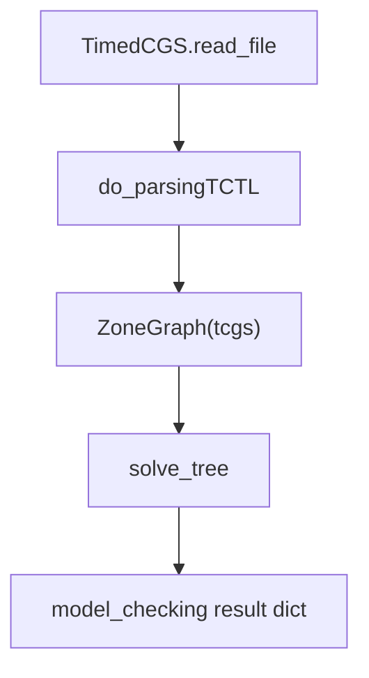

# TCTL - Implementation Reference

This document describes how TCTL (Timed Computation Tree Logic) is model-checked
in `model_checker/algorithms/explicit/TCTL/`. It is the normative reference for
behaviour in this codebase.

## Overview

TCTL extends CTL with clock constraints over **timedCGS** models. The checker
combines:

| Piece | Role |
|-------|------|
| Discrete CGS transitions | State jumps via joint actions |
| Clocks / invariants | Zone-based real-time semantics |
| Zone graph | Reachability in location-zone space |
| TCTL AST | Formula with optional clock guards (`x<=3`, `p: x<=1`) |

Path quantifiers are `E` and `A`. Temporal operators are `F`, `G`, and `U` (no
`X` or release in the parser grammar).

## timedCGS models

Models extend costCGS/CGS with three timed sections (see `TimedCGS.read_file` in
`parsers/game_structures/timed_cgs/timed_cgs.py`):

```text
Clocks
x y
Clock_constraints
...
Invariants
...
```

- `Clock_constraints`: per-transition guard/reset strings on the state matrix.
- `Invariants`: per-state clock bounds (e.g. `x<=2`).

Base sections (`Transition`, `Name_State`, `Initial_State`, `Atomic_propositions`,
`Labelling`, `Number_of_agents`) match costCGS/CGS.

Empty lines inside timed sections are ignored when loading (blank lines previously
cleared the `Clocks` list).

## Formula language

Parser: `parsers/formulas/TCTL/tctl_ply_parser.py` (AST classes on the same module).

### Propositional and clocks

```text
phi ::= p | ! phi | phi && phi | phi || phi | phi -> phi
      | x <= c | x < c | x >= c | x > c
      | phi : clock_expr
```

- `phi : x<=3` attaches a clock guard to a subformula (used during backward
  reachability).
- Standalone `x<=3` matches states whose zones satisfy the constraint.

### Temporal (CTL fragment)

```text
phi ::= E F phi | A F phi | E G phi | A G phi | E (phi U psi) | A (phi U psi)
```

Sugar: `F`/`G`/`U`/`until`/`eventually`/`globally`.

## Model-checking pipeline



Entry point: `model_checking(formula, filename)` in `TCTL/TCTL.py`.

### Evaluation (`solve_tree`)

The parser returns an AST (`AtomicProp`, `Unary`, `Binary`, `QuantifiedPath`,
`ClockExpr`, `SimpleTimeExpr`). Each node carries `satisfying_states: set[str]`.

Shared helpers live in `parsers/game_structures/timed_cgs/semantics.py`:

- `states_where_prop_holds`
- `extract_closest_constraint`
- `states_with_time_constraints`
- `zone_graph_pre_image_states` (timed backward step via zone graph)

### Pre-images

| Function | When used |
|----------|-----------|
| `discrete_pre_image_states` | No clock guard on the subformula |
| `pre_image_exist` | `EF`, `EG`, `EU`, `AF` (DBM backward step) |
| `zone_graph_pre_image_states` | `EF`/`AG` variants using zone-graph paths |

### Operator summary

| Operator | Idea |
|----------|------|
| `EF phi` | Least fixpoint: target union timed pre-image |
| `AF phi` | Complement of `EG` on complement |
| `EG phi` | Greatest fixpoint: phi intersect timed pre-image |
| `AG phi` | Complement of `EF` on complement |
| `E(phi U psi)` | Least fixpoint with phi cap pre-image |
| `A(phi U psi)` | Dual least fixpoint on complements |

`IMPLIES` is classical (`!phi or psi`), not intuitionistic.

## Code map

| Path | Role |
|------|------|
| `TCTL/TCTL.py` | VMI `model_checking` entry |
| `TCTL/solver.py` | AST traversal and handler dispatch |
| `TCTL/operators.py` | Temporal operator semantics |
| `TCTL/preimage.py` | DBM backward pre-image (`pre_image_exist`) |
| `shared/timed_ast_operators.py` | Shared boolean/leaf handlers for TCTL and TOL |
| `parsers/formulas/TCTL/` | Parser and AST types |
| `parsers/game_structures/timed_cgs/` | `TimedCGS`, `ZoneGraph`, `DBM`, `semantics` |

## Tests

| Path | Coverage |
|------|----------|
| `tests/integration/algorithms/tctl/test_smoke.py` | Pinned semantics on minimal timedCGS |
| `tests/fixtures/timedCGS/tctl_tol_minimal.txt` | Shared fixture with TOL |

## Related documentation

- [TOL implementation reference](TOL/algorithm.md)
- [File formats](../file_formats.md) (timedCGS sections)
- [Logic Knowledge Base](../logic_knowledge_base.md#tctl---timed-ctl)
