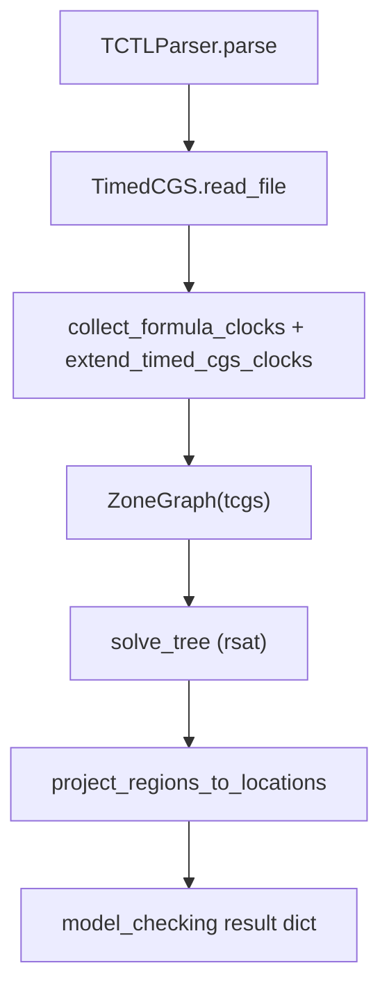

# TCTL - Implementation Reference

This document describes how **Timed Computation Tree Logic (TCTL)** is
model-checked in `model_checker/algorithms/explicit/TCTL/`. It follows Chapter 6
(regional transition system, TCTL-minus fragment, satisfaction relation, and the
`rsat` labelling algorithm).

## Overview

TCTL is checked over **timedCGS** models using a **zone graph** as a symbolic
representation of the regional transition system (RTS).

| Piece | Role |
|-------|------|
| timedCGS | Locations, transitions, automaton clocks `X`, guards, resets, invariants |
| Formula clocks `Y` | Collected from the AST; disjoint from `X`; extend the zone graph |
| Zone graph | Symbolic regions `(location, zone)` with delay and discrete edges |
| `rsat` labelling | Bottom-up evaluation into `satisfying_regions` per subformula |

Path quantifiers are `E` and `A`. Temporal operators are `F`, `G`, and `U`. There is
no `X` operator (timed systems do not have an untimed next step).

API results project regions to **location names** where at least one region
satisfies the formula. Initial-state satisfaction holds when any region at the
initial location is satisfying.

## TCTL-minus syntax (paper)

Clock sets:

- `X`: automaton clocks from the model `Clocks` section,
- `Y`: formula clocks from FREEZE and guards in the property.

```text
phi ::= p | gamma | !phi | phi && psi | phi || psi
      | y.reset(phi)                    -- FREEZE (VITAMIN: y.phi)
      | A[phi U psi]_gamma | E[phi U psi]_gamma
```

VITAMIN surface syntax:

```text
phi ::= p | ! phi | phi && phi | phi || phi | phi -> phi
      | x <= c | x < c | x >= c | x > c
      | j . phi                         -- FREEZE
      | phi : clock_expr                -- guard attachment (paper subscript gamma)
      | E F phi | A F phi | E G phi | A G phi
      | E (phi U psi) | A (phi U psi)
      | E phi U psi   | A phi U psi     -- same AST as parenthesized form
```

Sugar: `F` / `G` / `U` / `until` / `eventually` / `globally`.

Standard reductions:

- `EF phi`  ~ `E[true U phi]`
- `AF phi`  ~ `A[true U phi]`
- `EG phi`  ~ `!A[!phi U true]`
- `AG phi`  ~ `!E[!phi U true]`

Bounded until (paper encoding via FREEZE):

```text
A[phi U psi]_<=c  ~  y.reset(phi && A[true U (y<=c && psi)])   with fresh y in Y
```

## Satisfaction and `rsat`

- Atoms label all regions at locations where the proposition holds.
- Clock constraints label regions whose zones satisfy the guard (with invariants).
- **FREEZE** `y.phi`: region `r` satisfies `y.phi` when `r` with formula clock `y`
  reset to `0` satisfies `phi`.
- **Until** uses region-level fixpoints with timed backward steps. Because
  formulae are evaluated on each zone-graph node, prefix obligations correspond to
  the paper's `phi@i` requirement along delay and discrete edges.
- Boolean connectives are union, intersection, and complement over all regions in
  the zone graph.

## timedCGS models

Models extend costCGS/CGS with timed sections (`TimedCGS.read_file` in
`parsers/game_structures/timed_cgs/timed_cgs.py`):

```text
Clocks
x y
Clock_constraints
...
Invariants
...
```

Base sections (`Transition`, `Name_State`, `Initial_State`, `Atomic_propositions`,
`Labelling`, `Number_of_agents`) match costCGS/CGS.

## Model-checking pipeline



Entry point: `model_checking(formula, filename)` in `TCTL/TCTL.py`.

### Timed backward step `Pre`

All temporal operators share `timed_predecessors` in
`parsers/game_structures/timed_cgs/regions.py`: one reverse step in the zone graph
(delay and discrete edges). An optional clock guard filters predecessor zones.

### Fixpoints (region sets)

| Operator | Definition |
|----------|------------|
| `EF phi` | `lfp Z . Sat(phi) union Pre(Z)` |
| `AF phi` | `All \\ lfp Z . (All \\ Sat(phi)) union Pre(Z)` |
| `EG phi` | `gfp Z . Sat(phi) intersect Pre(Z)` |
| `AG phi` | `All \\ lfp Z . (All \\ Sat(phi)) union Pre(Z)` |
| `E(phi U psi)` | `lfp Z . Sat(psi) union (Sat(phi) intersect Pre(Z))` |
| `A(phi U psi)` | Dual least fixpoint on complements |

`All` is the set of all `(location, zone)` nodes in the zone graph.

## Code map

| Path | Role |
|------|------|
| `TCTL/TCTL.py` | Entry: parse, extend clocks, zone graph, solve, project |
| `TCTL/solver.py` | AST traversal and handler dispatch |
| `TCTL/evaluators.py` | Leaf, boolean, FREEZE, and clock-guard handlers |
| `TCTL/operators.py` | Temporal fixpoints on regions |
| `timed_cgs/regions.py` | Region sets, `timed_predecessors`, projection |
| `timed_cgs/formula_clocks.py` | Collect `Y` from AST; extend `TimedCGS` |
| `timed_cgs/zone_graph.py` | Zone graph construction |
| `parsers/formulas/TCTL/` | Parser and AST types |

## Tests

| Path | Coverage |
|------|----------|
| `tests/integration/algorithms/tctl/test_correctness.py` | Temporal ops, guards, FREEZE |
| `tests/fixtures/timedCGS/tctl_tol_minimal.txt` | Shared timedCGS with TOL |
| `parsers/game_structures/timed_cgs/tests/test_zone_graph.py` | Zone graph paths and guards |
