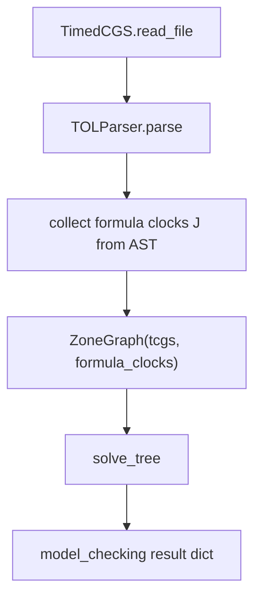

# TOL - Implementation Reference

This document describes how **Timed Obstruction Logic (TOL)** is model-checked in
`model_checker/algorithms/explicit/TOL/`. It follows the syntax, semantics, and
algorithms of Leneutre, Malvone, and Ortiz (AAMAS 2025, Timed Obstruction Logic),
adapted to the VITAMIN `timedCGS` surface syntax.

## Overview

TOL is a **linear** timed logic with **demonic obstruction prefixes** `{Jk}` over
weighted timed models. At each step the Demon may deactivate outgoing transitions
whose total deactivation cost is at most `k`; the Adversary then chooses a
non-deactivated transition. A formula holds at a state when the Demon has an
`n`-strategy such that **every** compatible path satisfies the temporal property.

| Piece | Role |
|-------|------|
| timedCGS / WTA | Locations, weighted edges, automaton clocks |
| Zone graph `ZG(A, phi)` | Symbolic timed states; built from the model and formula clocks |
| `{Jk}` prefix | Strategic grade `n` (positive integer); VITAMIN syntax for paper `⟨n⟩` |
| `triangle` / `triangle_down` | Obstruction predecessor `▼(n, Z)` (Definition 15) |
| TOL AST | `DemonicOp`, `DemonicBinary`, `FreezeExpr`, clock nodes |

There are no path quantifiers `E`/`A`; branching is not part of the syntax.

## timedCGS models

Same file format as TCTL (see [TCTL/algorithm.md](../TCTL/algorithm.md)). TOL uses
`TimedCGS.read_file` and `ZoneGraph`.

Transition cells may be:

- `0` (no edge),
- integers (deactivation cost `W(e)` on that edge),
- costCGS-style strings with `:` segments (summed in `_transition_cost`).

Costs label **deactivation** of edges; they do not constrain discrete behaviour
beyond the obstruction game (WTA semantics, Definition 5).

## Formula language

Parser: `parsers/formulas/TOL/tol_ply_parser.py`.

### Propositional and clocks

```text
phi ::= p | ! phi | phi && phi | phi || phi | phi -> phi
      | x <= c | x < c | x >= c | x > c
      | phi : clock_expr | phi with clock_expr
      | j . phi
```

- Atoms: lowercase identifiers (`p`, `safe_1`) or mixed-case names with a lowercase
  second letter (`Goal`). Single-letter uppercase tokens (`F`, `G`, `X`, `U`, `R`,
  `W`) remain temporal operators. Clock names in comparisons (`x<=3`) use the same
  token class as propositions.
- **Automaton clocks** (`X` in the paper) come from the `Clocks` section of the model.
- **Formula clocks** (`J` in the paper, disjoint from automaton clocks) appear in
  freeze and guards; they are collected from the AST and added when building
  `ZG(A, phi)`.
- `j . phi` (**freeze**): `phi` is evaluated with formula clock `j` reset to `0` at
  the current state (Definition 11). VITAMIN surface syntax uses a dot: `j.phi`.
- `phi : x<=c` attaches a clock guard used during timed backward reachability
  (same attachment style as TCTL).

### Demonic temporal operators

Paper grammar uses `⟨n⟩(phi U psi)` and `⟨n⟩(phi R psi)`. VITAMIN writes `{Jk}`:

```text
phi ::= {Jk} F phi | {Jk} G phi
      | {Jk} (phi U psi) | {Jk} (phi R psi) | {Jk} (phi W psi)
      | {Jk} X phi          -- VITAMIN extension (see below)
```

- `{Jk}`: demonic prefix, `k` a positive integer (`{J[1-9]...}`).
- Sugar (paper): `{Jk} F phi := {Jk} (true U phi)`, `{Jk} G phi := {Jk} (false R phi)`,
  `{Jk} (phi W psi) := {Jk} (psi R (phi || psi))`.

### VITAMIN extensions (not in the paper)

| Extension | Semantics |
|-----------|-----------|
| `{Jk} X phi` | One-step obstruction: `▼(k, Sat(phi))` (discrete/timed pre-image of `Sat(phi)`, filtered by `triangle`) |
| `R`, `W` in surface syntax | Paper defines `W` as sugar; `R` is primitive |
|\|\|, `->` | Standard boolean derived connectives |

The paper omits `X` because continuous time has no unique next instant; the
extension is kept for tool parity with OL-style step checks under obstruction.

## Obstruction cost (`triangle`)

Definition 15 (paper): for symbolic set `Z`, state `z`, and bound `n`,

```text
▶(z, n, Z) = ( sum of W(z, sigma, z') over transitions z -> z' with z' NOT in Z ) <= n
▼(n, Z)    = { z in Pred(Z) | ▶(z, n, Z) }
```

`Pred(Z)` is the timed or discrete pre-image of `Z` (zone-graph backward step when
a clock guard is present on the operand).

Implementation (`preimage.py`):

- `triangle(tcgs, source_idx, bound, inside_indices)` sums deactivation costs of
  edges from `source_idx` to targets **outside** `inside_indices` (the current set
  `Z`). Returns whether that sum is `<= bound`.
- `triangle_down(tcgs, zone_graph, n, states, constraints)` computes `▼(n, Z)` on
  location names: discrete or timed `Pred(Z)`, then filter by `triangle`.

**Cost budget:** `k` is a **per-position** demonic budget (fresh at each step of the
obstruction game), not cumulative path cost. This matches the paper and differs
from OL in VITAMIN, which uses accumulated shortest-path cost for `F`/`G`/`U`/`R`/`W`.

Delay transitions (`d` in `Sigma_delta`) have cost `0` in the matrix; timed
pre-images use the zone graph.

## Model-checking pipeline



Entry point: `model_checking(formula, filename)` in `TOL/TOL.py`.
Evaluation: `solve_tree` in `TOL/solver.py`.

### Fixpoint algorithms (paper Algorithms 1-3)

| Operator | Computation |
|----------|-------------|
| `{Jk} (phi U psi)` | Least fixpoint: `Y <- psi union (phi intersect ▼(k, Y))` (Algorithm 2) |
| `{Jk} (phi R psi)` | Greatest fixpoint: `Y <- psi intersect (phi union ▼(k, Y))` (Algorithm 3) |
| `{Jk} F phi` | `{Jk} (true U phi)` |
| `{Jk} G phi` | `{Jk} (false R phi)` |
| `{Jk} (phi W psi)` | `{Jk} (psi R (phi or psi))` |
| `{Jk} X phi` | `▼(k, Sat(phi))` (extension) |
| `j . phi` | `Sat(phi)` with formula clock `j` in `ZG(A, phi)`; reset at entry (Algorithm 1) |

AST node types: `AtomicProp`, `Unary`, `Binary`, `DemonicOp`, `DemonicBinary`,
`FreezeExpr`, `ClockExpr`, `SimpleTimeExpr`.

Shared timed helpers: `parsers/game_structures/timed_cgs/semantics.py`.

## Code map

| Path | Role |
|------|------|
| `TOL/TOL.py` | Entry, formula-clock setup, `ZoneGraph` construction |
| `TOL/solver.py` | AST traversal and operator dispatch |
| `TOL/operators.py` | Per-operator handlers and fixpoints |
| `TOL/preimage.py` | `triangle`, `triangle_down`, discrete/timed pre-images |
| `timed_cgs/formula_clocks.py` | Collect `J` from AST; extend `clocks_dict` |
| `shared/timed_ast_operators.py` | Shared boolean/leaf handlers for TCTL and TOL |
| `parsers/formulas/TOL/` | Parser and AST types |
| `parsers/game_structures/timed_cgs/` | Model, zones, shared `semantics` |

## Tests

| Path | Coverage |
|------|----------|
| `tests/integration/algorithms/tol/test_smoke.py` | Zero-cost pipeline |
| `tests/integration/algorithms/tol/test_correctness.py` | Paper `▼` semantics on weighted fixture |
| `tests/fixtures/timedCGS/tctl_tol_minimal.txt` | Shared zero-cost fixture with TCTL |
| `tests/fixtures/timedCGS/tol_cost_2states.txt` | Two-state obstruction-cost fixture |

## Related documentation

- [TCTL implementation reference](../TCTL/algorithm.md)
- [File formats](../file_formats.md)
- [Logic Knowledge Base](../logic_knowledge_base.md#tol---timed-obstruction-logic)
- [Semantics decisions](../audits/semantics_decisions.md) (TOL per-step obstruction vs OL)
