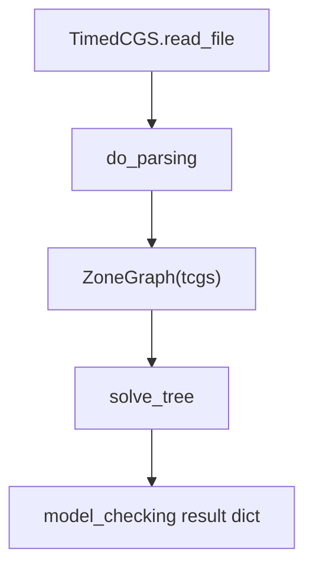

# TOL - Implementation Reference

This document describes how TOL (Timed Obligation Logic) is model-checked in
`model_checker/algorithms/explicit/TOL/`. It is the normative reference for
behaviour in this codebase.

## Overview

TOL is a **linear-style** timed logic with **demonic cost prefixes** `{Jk}` over
timedCGS models. Each formula is evaluated under a bound `k` on accumulated
transition cost (the `triangle` / `triangle_down` operators).

| Piece | Role |
|-------|------|
| timedCGS graph | States and transitions (optionally with numeric/cost labels) |
| Zone graph | Timed pre-image when clock guards are present |
| `{Jk}` prefix | Cost bound for demonic transitions |
| TOL AST | Formula tree with `DemonicOp` / `DemonicBinary` nodes |

There are no path quantifiers `E`/`A`; branching is not part of the syntax.

## timedCGS models

Same file format as TCTL (see [TCTL/algorithm.md](../TCTL/algorithm.md)). TOL uses
`TimedCGS.read_file` and `ZoneGraph`.

Transition cells may be:

- `0` (no edge),
- integers (transition cost for `triangle`),
- costCGS-style strings with `:` segments (summed in `_transition_cost`).

## Formula language

Parser: `parsers/formulas/TOL/tol_ply_parser.py`.

### Propositional and clocks

```text
phi ::= p | ! phi | phi && phi | phi || phi | phi -> phi
      | x <= c | ...
      | phi : clock_expr | phi with clock_expr
```

### Demonic temporal operators

```text
phi ::= {Jk} X phi | {Jk} F phi | {Jk} G phi
      | {Jk} (phi U psi) | {Jk} (phi R psi) | {Jk} (phi W psi)
```

- `{Jk}`: demonic prefix (`DEMONIC` token), `k` a positive integer.
- `W` / `weak`: weak until.

## Cost-bounded moves

`triangle(tcgs, s, n, excluded)` sums transition costs from state `s` to states
**outside** the current target set and checks the sum is at most `n`.

`triangle_down(tcgs, zone_graph, n, states, constraints)`:

1. Timed or discrete pre-image of `states`.
2. Keep predecessors whose `triangle` cost to leave the set is at most `n`.

When a clock constraint is present on the operand, `pre_timed_indices` delegates to
`zone_graph_pre_image_states` in `semantics.py`; otherwise `pre_indices` uses
`discrete_pre_image_states`.

## Model-checking pipeline



Entry point: `model_checking(formula, filename)` in `TOL/TOL.py`. Evaluation: `solve_tree` in `TOL/solver.py`.

AST node types: `AtomicProp`, `Unary`, `Binary`, `DemonicOp`, `DemonicBinary`,
`ClockExpr`, `SimpleTimeExpr`.

Shared timed helpers: `parsers/game_structures/timed_cgs/semantics.py`.

### Operator summary

| Operator | Fixpoint style |
|----------|----------------|
| `{Jk} X phi` | One-step `triangle_down` |
| `{Jk} F phi` | Least fixpoint with cost-bounded pre-image |
| `{Jk} G phi` | Greatest fixpoint: phi intersect cost-bounded pre-image |
| `{Jk} (phi U psi)` | Least fixpoint on psi with phi cap `triangle_down` |
| `{Jk} (phi R psi)` | Greatest fixpoint on psi with phi union `triangle_down` |
| `{Jk} (phi W psi)` | Greatest fixpoint variant (weak until) |

## Code map

| Path | Role |
|------|------|
| `TOL/TOL.py` | VMI entry, `_core_model_checking` |
| `TOL/solver.py` | AST traversal and operator dispatch |
| `TOL/operators.py` | Per-operator handlers and fixpoints |
| `TOL/preimage.py` | Cost-bounded `triangle_down` and discrete/timed pre-images |
| `shared/timed_ast_operators.py` | Shared boolean/leaf handlers for TCTL and TOL |
| `parsers/formulas/TOL/` | Parser and AST types |
| `parsers/game_structures/timed_cgs/` | Model, zones, shared `semantics` |

## Tests

| Path | Coverage |
|------|----------|
| `tests/integration/algorithms/tol/test_smoke.py` | Pipeline on zero-cost minimal timedCGS |
| `tests/integration/algorithms/tol/test_correctness.py` | Pinned `{Jk}` semantics with transition costs, release, weak until |
| `tests/fixtures/timedCGS/tctl_tol_minimal.txt` | Shared zero-cost fixture with TCTL |
| `tests/fixtures/timedCGS/tol_cost_2states.txt` | Two-state cost-bounded TOL fixture |

## Related documentation

- [TCTL implementation reference](../TCTL/algorithm.md)
- [File formats](../file_formats.md)
- [Logic Knowledge Base](../logic_knowledge_base.md#tol---timed-obligation-logic)
