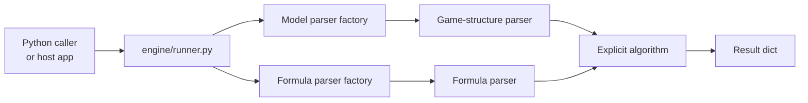
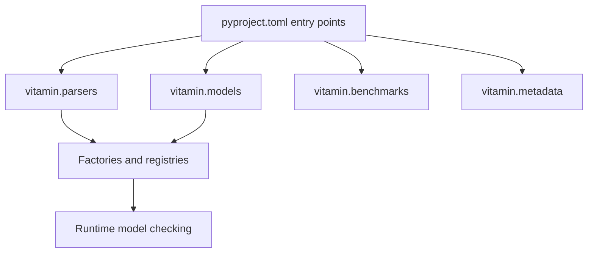
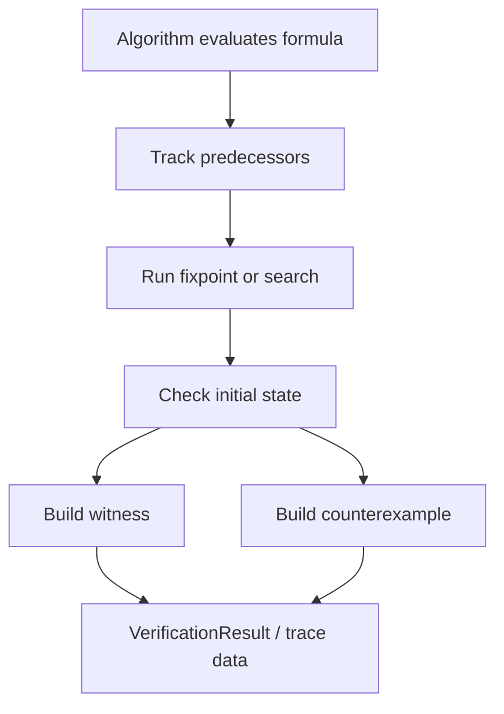

# Architecture

This page explains how the `model_checker` package is organized and where to
make changes safely. It focuses on the library itself. For the wider project
relationship with VMI and Workbench, see [VITAMIN Stack](vitamin-stack.md).

## Runtime Shape

The package separates model parsing, formula parsing, and verification
algorithms. The engine layer connects them and keeps the public call shape
consistent.



The algorithms are explicit-state algorithms. They work over an in-memory model
and traverse the state space directly. That keeps the implementation readable
and makes traces easier to build, but large models can use a lot of memory.

## Package Layers

```text
model_checker/
├── algorithms/explicit/        # per-logic checking algorithms
├── benchmarking/               # pyperf benchmark CLI and cases
├── engine/                     # shared runner and execution helpers
├── parsers/
│   ├── formulas/               # per-logic formula parsers
│   └── game_structures/        # CGS, costCGS, capCGS parsers
├── shared/                     # trace/result helpers
├── tests/                      # unit, integration, e2e, performance tests
└── utils/                      # error handling and shared utilities
```

### Parser Layer

Model parsers read `.txt` model files and build in-memory game structures.
Current built-in model types are:

- `CGS`
- `costCGS`
- `capCGS`

Formula parsers live under `parsers/formulas/<Logic>/` and parse formulas into
trees used by the algorithms. Most are built with PLY.

Callers should go through the factories instead of instantiating parsers
directly:

- `FormulaParserFactory`
- `create_model_parser_for_logic`

### Engine Layer

`engine/runner.py` handles the common work around each model-checking call:

- validate input,
- choose the correct model parser,
- read the model file,
- call the logic algorithm,
- normalize errors.

Logic modules expose the public shape:

```python
model_checking(formula: str, filename: str) -> dict
```

Inside that function, use `execute_model_checking_with_parser(...)` so the
shared validation and error handling stay consistent.

### Algorithm Layer

Each logic has a module under `algorithms/explicit/<Logic>/`. Algorithms should
receive the parsed model object from the runner, parse the formula with the
right parser, evaluate the formula tree, and return a standard result dict.

Use shared helpers where possible:

- `format_model_checking_result`
- `verify_initial_state`
- `model_checker.utils.error_handler`
- trace helpers under `model_checker/shared/`

## Entry Points

`pyproject.toml` advertises built-in logic components through Python entry
points:

| Entry-point group | Purpose |
|---|---|
| `vitamin.parsers` | Logic name to formula parser class. |
| `vitamin.models` | Model type to game-structure parser class. |
| `vitamin.benchmarks` | Logic name to benchmark/model-checking callable. |
| `vitamin.metadata` | Logic name to metadata exposed by parser packages. |

VMI uses the same pattern when it integrates a logic bundle into this repo. That
is why new logic docs talk about entry points instead of runtime monkey-patching.



## Trace Flow

Some logics can return witness or counterexample traces. CTL has the most
complete trace coverage today.



Trace helpers live in `model_checker/shared/`. Keep trace construction in shared
helpers when several logics can reuse the same path reconstruction behavior.

## Adding Logic

The recommended path for adding a new logic is:

1. Build a VMI bundle.
2. Validate it with `vitamin-module-integrator`.
3. Let VMI integrate files and entry points into this repository.
4. Run this repository's tests and benchmarks where relevant.

Maintainers can still add or change built-in logic manually. See
[Adding a New Logic](adding_a_new_logic.md) for both workflows.

## Testing And Performance

Tests live under `model_checker/tests/`:

- `unit/` for small parser/helper/algorithm pieces,
- `integration/` for real model files and public API behavior,
- `e2e/` for full user-like workflows,
- `performance/` for time-bound regression checks.

Benchmarks live under `model_checker/benchmarking/` and use `pyperf`. Use them
when an algorithm change may affect runtime, not as a replacement for
correctness tests.

## Known Limits

- The current algorithms are explicit-state and can be memory-heavy.
- Symbolic model checking is not part of this package today.
- Trace support varies by logic.
- Workbench HTTP behavior lives in the sibling `vitamin-workbench` project, not
  in this repository.
