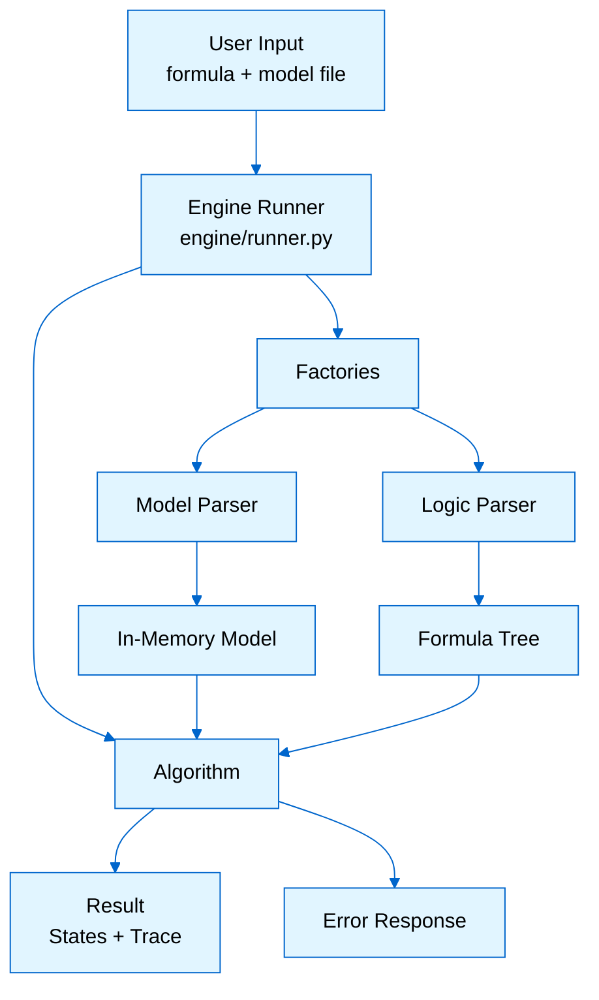
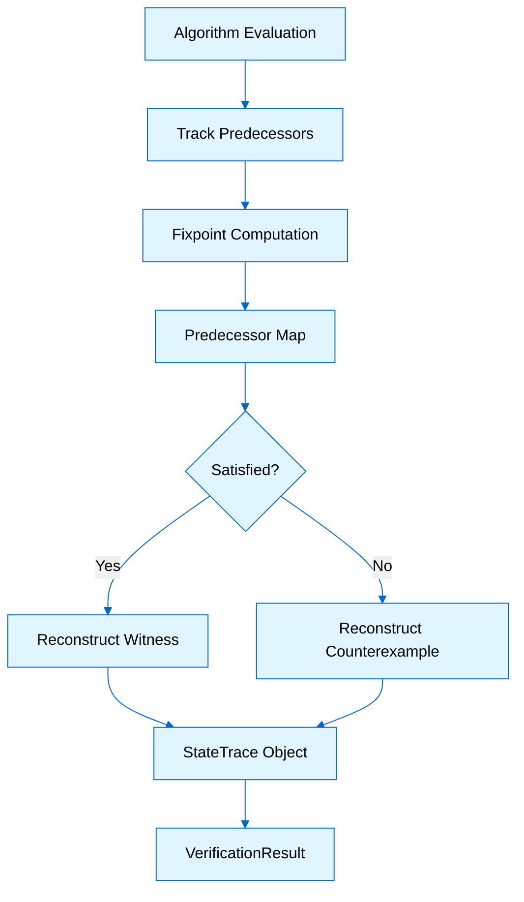

# VITAMIN Model Checker Architecture

This document describes the structure of the `model_checker` package and how to extend it.

## Overview

The architecture separates parsing from verification. Parsers convert input (files/strings) into in-memory structures. Algorithms run the verification logic. The engine connects these components. This design allows new logics or model types to be added without changing existing code.

The system uses **explicit state model checking**: the full state space is built in memory and traversed directly. This approach is simple and enables straightforward witness/counterexample generation, though it uses more memory.

## System Components

### Parser Layer

The parser layer has two independent subsystems:

**1. Model Parsers** (`parsers/game_structures/`)
-   Read model files and create in-memory objects.
-   Supported types: `CGS` (standard), `costCGS` (with costs), `capCGS` (with capacities).
-   **Model Factory**: Always use `create_model_parser_for_logic` (in `models.model_factory`) to instantiate model parsers based on the target logic's requirements.

**2. Logic Parsers** (`parsers/formulas/`)
-   Parse temporal logic formulas into structured trees.
-   One parser per logic (CTL, ATL, LTL, etc.).
-   Built with PLY (Python Lex-Yacc).
-   Parsers are independent and thread-safe.
-   **Factory Pattern**: Always use `FormulaParserFactory` to create parsers.

### Algorithm Layer

Algorithms reside in `algorithms/explicit/`, organized by logic. Each algorithm follows this flow:

1.  Instantiate the logic parser via `FormulaParserFactory`.
2.  Parse the formula into a tree.
3.  Recursively evaluate the tree against the model.
4.  Return the set of states satisfying the formula.

**Trace Generation:**
Logic like CTL supports trace generation (witnesses/counterexamples) using `solver_with_trace.py`. Trace data structures are defined in `shared/verification_result.py`.

### Engine Layer

The engine (`engine/runner.py`) is the entry point. It handles:
-   Input validation.
-   Parser creation (via factories).
-   File reading.
-   Error normalization.
-   Delegation to the specific algorithm.

### Utilities Layer

-   **Error Handling** (`utils/error_handler.py`): Returns structured error dictionaries (syntax, semantic, model, system).
-   **Trace Utils** (`shared/trace_utils.py`): Reconstructs paths from predecessor maps (BFS).
-   **Verification Result** (`shared/verification_result.py`): Defines `StateTrace`, `StrategyTrace`, and `VerificationResult`.

## Data Flow

## Trace Generation Flow

When enabled, the algorithm tracks predecessors during evaluation:

1.  **Track**: Algorithm records predecessors during fixpoint computation.
2.  **Evaluate**: Determine satisfaction at the initial state.
3.  **Reconstruct**: Build the path (witness or counterexample) using the predecessor map.
4.  **Result**: Return `VerificationResult` containing the trace.

## Extensibility

A step-by-step guide for adding a new logic (formula parser, algorithm, API config, tests, examples) is in [adding_a_new_logic](adding_a_new_logic.md). It describes the current structure and the required result contract so new logics work with the API and tests consistently.

### Adding a New Logic (summary)

1.  Create a parser class in `parsers/formulas/<LogicName>/parser.py` inheriting `BaseLogicParser`.
2.  Register it in `parsers/formula_parser_factory.py`.
3.  Implement the algorithm in `algorithms/explicit/<LogicName>/` with `model_checking(formula, filename)` and the standard return dict; use `engine.runner.execute_model_checking_with_parser` and shared result helpers.
4.  Register the logic in the API: `LogicType`, `workbench/api/prompts/logic_config.yaml`, `workbench/api/services/model_checking/utils/logic_config.py`, and `models/model_factory.py` (model type mapping).
5.  Add integration tests and example model + formula files.

### Adding a New Model Type

1.  Create a parser in `parsers/game_structures/<ModelType>/`.
2.  Update `parsers/model_parser_factory.py` to detect and create the new type.

## Testing

Testing is stratified:
-   **Unit Tests**: Parsers (parsing only) and Algorithms (logic only).
-   **Integration Tests**: End-to-end file processing.
-   **Correctness**: Verification against known-good results.

## Performance

-   **Time**: Logic-dependent (CTL: Polynomial, ATL: Exponential in coalition size).
-   **Memory**: Linear in state space size (explicit state).
-   **Timeout**: Default 30s (configurable).

## Concurrency

-   **Thread Safety**: Parsers are independent instances.
-   **Parallelism**: Multiple requests run concurrently. Individual runs are single-threaded.

## Limitations

-   **Memory**: Large models may exceed memory limits due to explicit state representation.
-   **Symbolic**: No support for symbolic model checking yet.
-   **Trace**: Full support for CTL; other logics vary.

