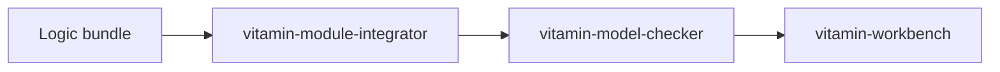

# VITAMIN Model Checker

This is the developer and reference documentation for the VITAMIN model-checker
library. Use it when you need to understand the package internals, model file
formats, logic implementations, tests, or benchmarks.

## Reading Paths

| If you want to... | Start here |
|---|---|
| Understand the package structure | [Architecture](architecture.md) |
| Add or integrate a new logic | [Adding a New Logic](adding_a_new_logic.md) |
| Understand model and formula files | [File Formats](file_formats.md) |
| See how this repo fits with VMI and Workbench | [VITAMIN Stack](vitamin-stack.md) |
| Contribute to this repository | [Contributing](contributing.md) |
| Browse Python package docs | [API Overview](api/overview.md) |
| Check deployment ports | [Deployment Ports](deployment-ports.md) |

## What This Repository Owns

- formula parsers under `model_checker/parsers/formulas/`,
- model parsers under `model_checker/parsers/game_structures/`,
- explicit-state algorithms under `model_checker/algorithms/explicit/`,
- shared execution in `model_checker/engine/runner.py`,
- test fixtures and correctness tests under `model_checker/tests/`,
- benchmark tooling under `model_checker/benchmarking/`,
- Python entry points in `pyproject.toml`.

It does not own the Workbench HTTP API. It also does not own the VMI UI. Those
live in sibling projects and call into this package.

## Typical Workflows

Most new logic work should start as a bundle in `vitamin-module-integrator`.
Maintainers can still work directly in this repository when changing core
contracts, built-in logics, model parsers, or performance-sensitive internals.
