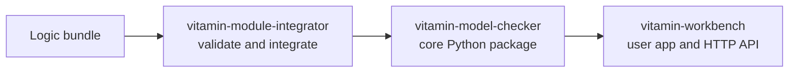

# VITAMIN Stack

The VITAMIN projects work together, but each repo owns a different part of the
system.

## Project Roles

| Project | Owns | Does not own |
|---|---|---|
| `vitamin-model-checker` | Parsers, model structures, algorithms, tests, benchmarks, Python entry points. | Bundle upload UI, HTTP routes, AI prompts, Workbench UI. |
| `vitamin-module-integrator` | Bundle standard, validation pipeline, integration pipeline, cleanup, generated OpenAPI client for its own UI. | Core model-checking algorithm implementation. |
| `vitamin-workbench` | User-facing app, backend API, prompts, UI flows. | The core parser/algorithm package. |

## How A Logic Moves Through The Stack

1. A contributor packages logic code as a VMI bundle.
2. VMI validates parser, checker, structure, dependencies, examples, and tests.
3. VMI integrates the bundle into this repo by copying files and patching entry
   points.
4. This repo's tests and benchmarks confirm the core package still behaves.
5. Workbench can expose the logic in the user-facing application when its own
   config/UI is updated.

Keep documentation in the repo that owns the behavior. If a change is about
Python parser or algorithm behavior, document it here. If a change is about
bundle validation or integration UX, document it in `vitamin-module-integrator`.
If a change is about HTTP routes or prompts, document it in `vitamin-workbench`.
